# Deployment Flowchart 📊

Visual guide for deploying to Vercel.

---

## 🔄 Complete Deployment Flow

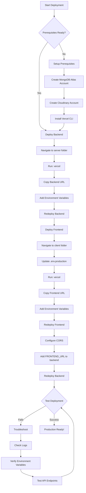

---

## 🎯 Backend Deployment Flow

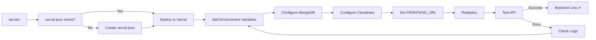

---

## 🎨 Frontend Deployment Flow

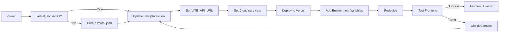

---

## 🔐 Environment Variables Setup

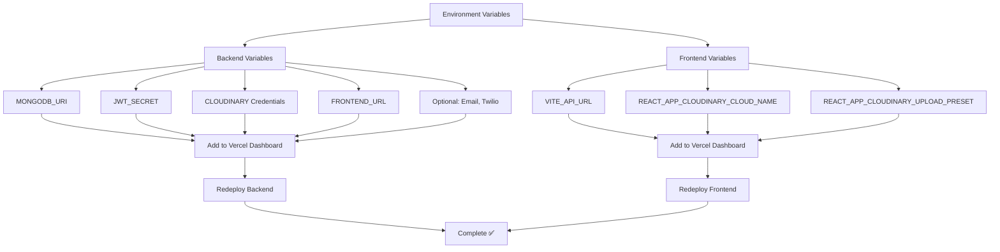

---

## 🔄 CORS Configuration Flow

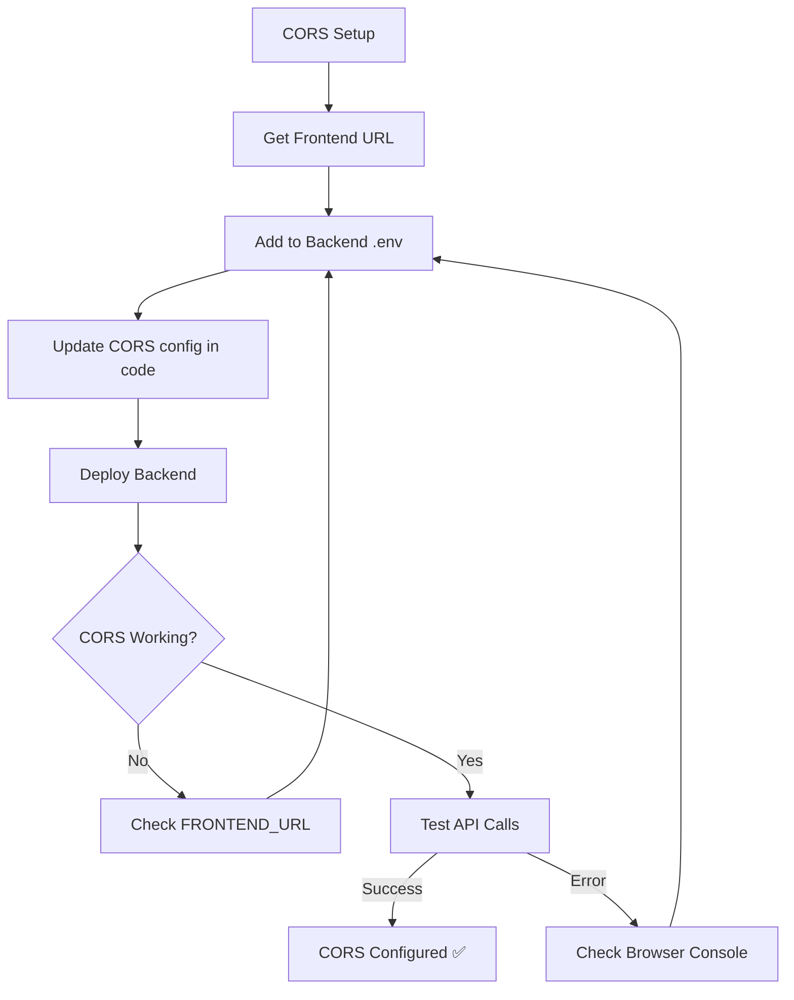

---

## 🧪 Testing Flow

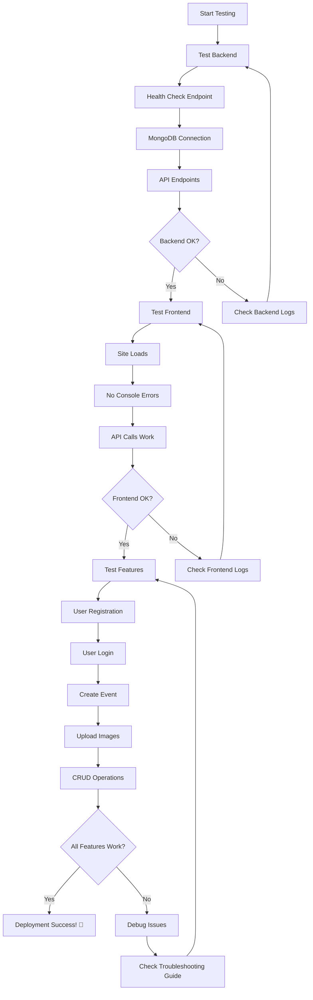

---

## 🚨 Troubleshooting Decision Tree

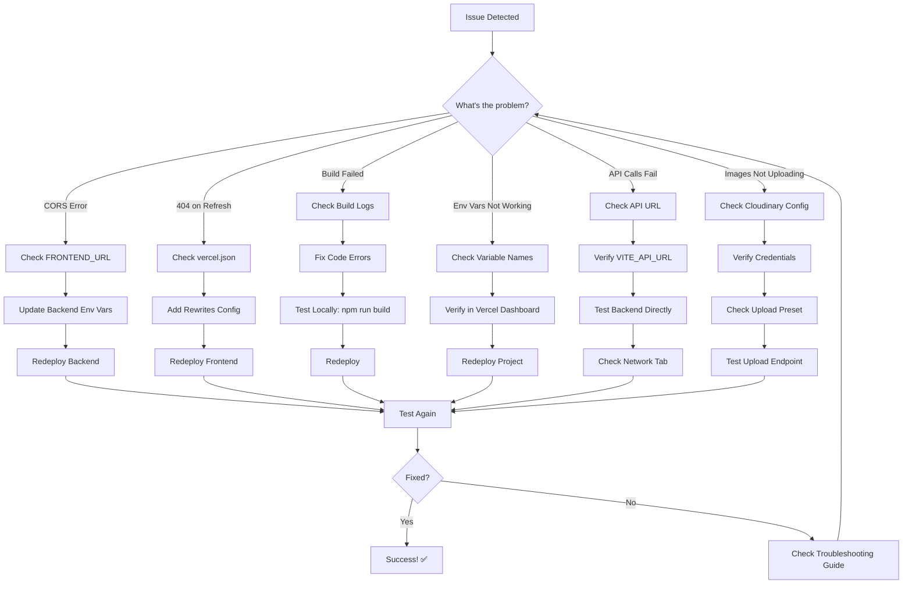

---

## 📊 Deployment Stages

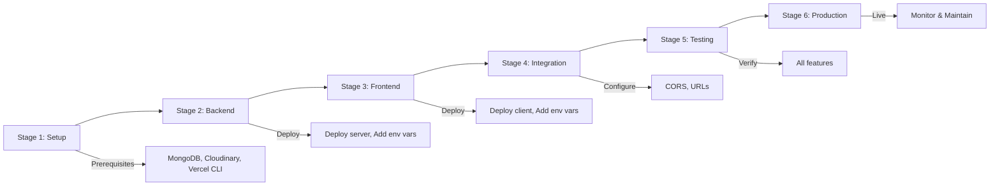

---

## ⏱️ Time Estimates

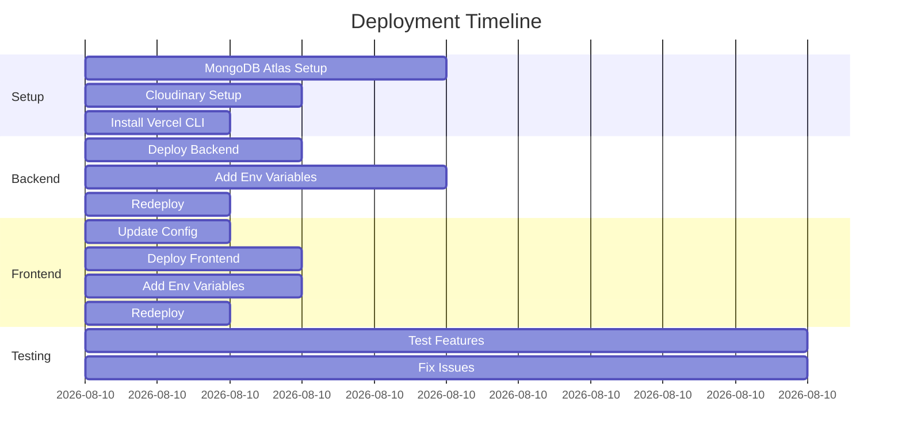

**Total Time: ~50 minutes** (first deployment)

**Subsequent Deployments: ~2 minutes** (auto-deploy on push)

---

## 🎯 Success Criteria Flowchart

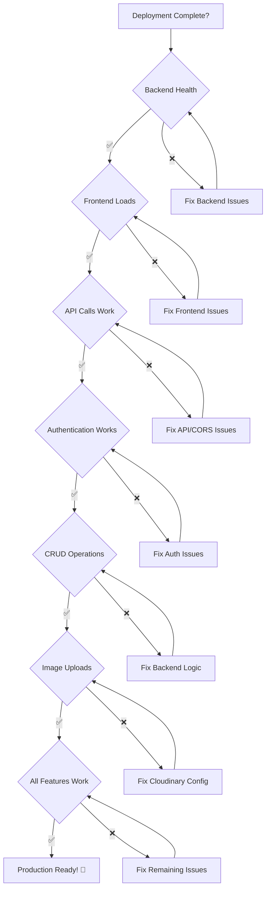

---

## 📈 Monitoring Flow

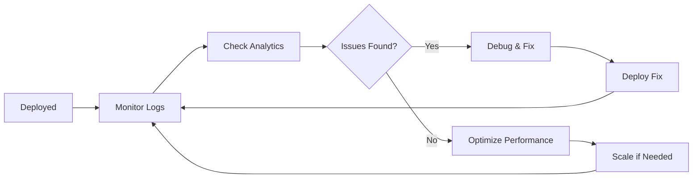

---

## 🔄 Continuous Deployment Flow

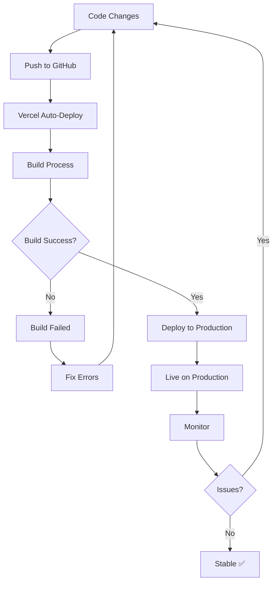

---

*Use these flowcharts to visualize the deployment process!*
